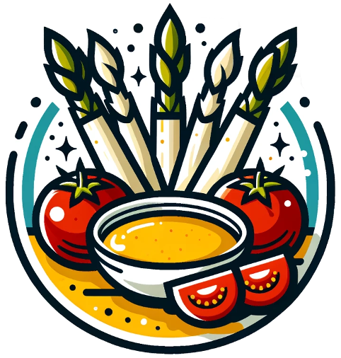

# QookA 
This repository accompanies the paper **QookA: A Cooking Question Answering Dataset**.

## Where is the dataset?
The dataset is stored in the `qooka_dataset.csv` file.

## What do the columns mean?
- `global_turn_id`: A unique identifier for each turn, combining the conversation ID and the turn ID in the format <conv_id>_<turn_id>, e.g., 10_4 

- `query`: The recorded and transcribed query issued by a crowdworker, e.g., "How much sugar do I need to add?"

- `answer`: The answer to the query, e.g., "200g"

- `alternative_answer`:  Sometimes, multiple answers are plausible. If multiple alternative answers exist, they are separated by a `|` delimiter, e.g., "1 cup|7 oz" 

- `level_0_query_need`: The cooking information need label at level 0, according to Frummet et al.'s taxonomy (see [codebook](https://github.com/AlexFrummet/CookversationalSearch/blob/master/annotation/annotation_schema_cookversational_search.xlsx) and [info. need tree](https://github.com/AlexFrummet/CookversationalSearch/blob/master/annotation/InfoNeedTaxonomy.svg)), e.g., "fact"

- `level_1_query_need`: The cooking information need label at level 1 according to Frummet et al.'s taxonomy (see [codebook](https://github.com/AlexFrummet/CookversationalSearch/blob/master/annotation/annotation_schema_cookversational_search.xlsx) and [info. need tree](https://github.com/AlexFrummet/CookversationalSearch/blob/master/annotation/InfoNeedTaxonomy.svg)), e.g., "amount" 

- `is_exact_query_answer_match`: True if the query exactly matches with the highlighted word, and false if not.

- `is_internal_knowledge_source`: True if the answer is found within the recipe, and false if not.

- `is_reasoning`: True for yes/no questions and reasoning that requires background cooking knowledge. For example, "Can I use a normal spoon as well?" is true; false if not.

- `recipe_id`: The recipe ID that the current turn is referring to, e.g., 49

- `recipe_title`: The title of the recipe that the current turn is referring to, e.g., "Thai Spicy Duck Salad Recipe"

- `step_number`: The step number the query is referring to, e.g., 1

- `conv_id`: The conversation ID the query is referring to, e.g., 10

- `turn_id`: The turn ID within the current conversation, e.g., 4

## Citation
```bibtex
@inproceedings{frummet2024qooka,
author = {Frummet, Alexander and Elsweiler, David},
title = {QookA: A Cooking Question Answering Dataset},
year = {2024},
isbn = {9798400704345},
publisher = {Association for Computing Machinery},
address = {New York, NY, USA},
url = {https://doi.org/10.1145/3627508.3638311},
doi = {10.1145/3627508.3638311},
abstract = {Conversational agents have become increasingly integrated into our daily lives, including assisting with cooking-related tasks. To address these issues and supplement other datasets, we introduce QookA—a unique dataset featuring spoken queries, associated information needs, and answers rooted in cooking recipes. QookA overcomes shortcomings in existing datasets, laying the foundation for more effective conversational agents tailored to cooking tasks. This paper outlines the dataset construction process, analyzes the data, and explores research applications, providing a valuable resource to enhance conversational agents in the cooking domain.},
booktitle = {Proceedings of the 2024 ACM SIGIR Conference on Human Information Interaction and Retrieval},
pages = {406–410},
numpages = {5},
keywords = {conversational search, cooking, question answering},
location = {<conf-loc>, <city>Sheffield</city>, <country>United Kingdom</country>, </conf-loc>},
series = {CHIIR '24}
}
```

